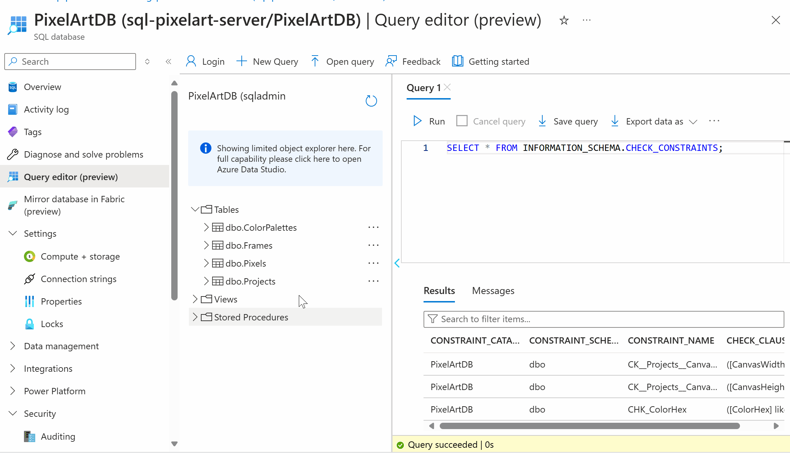
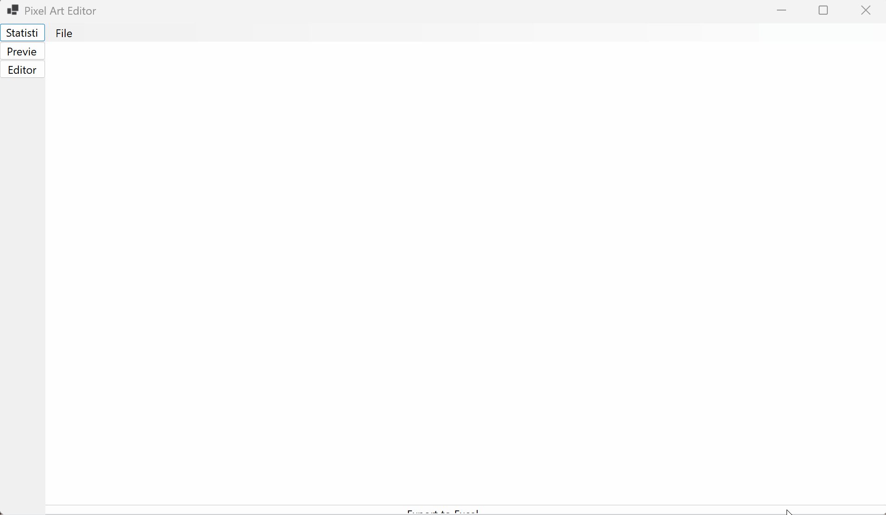
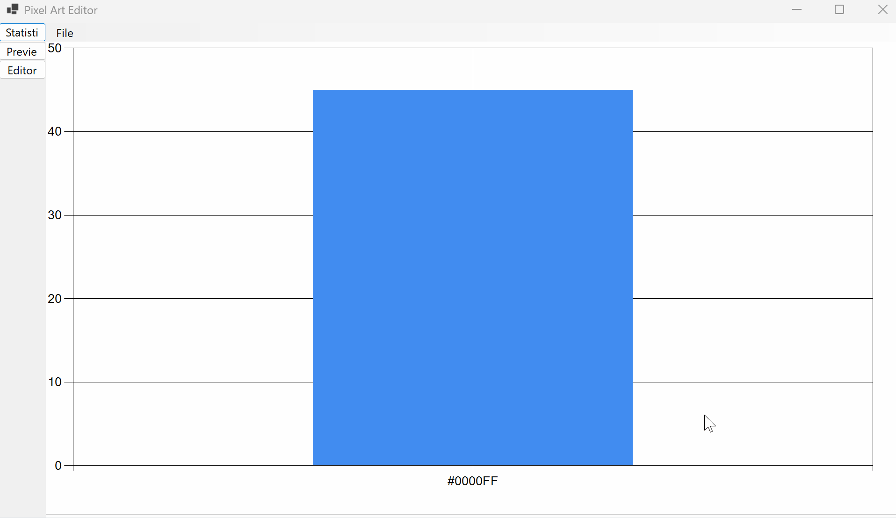
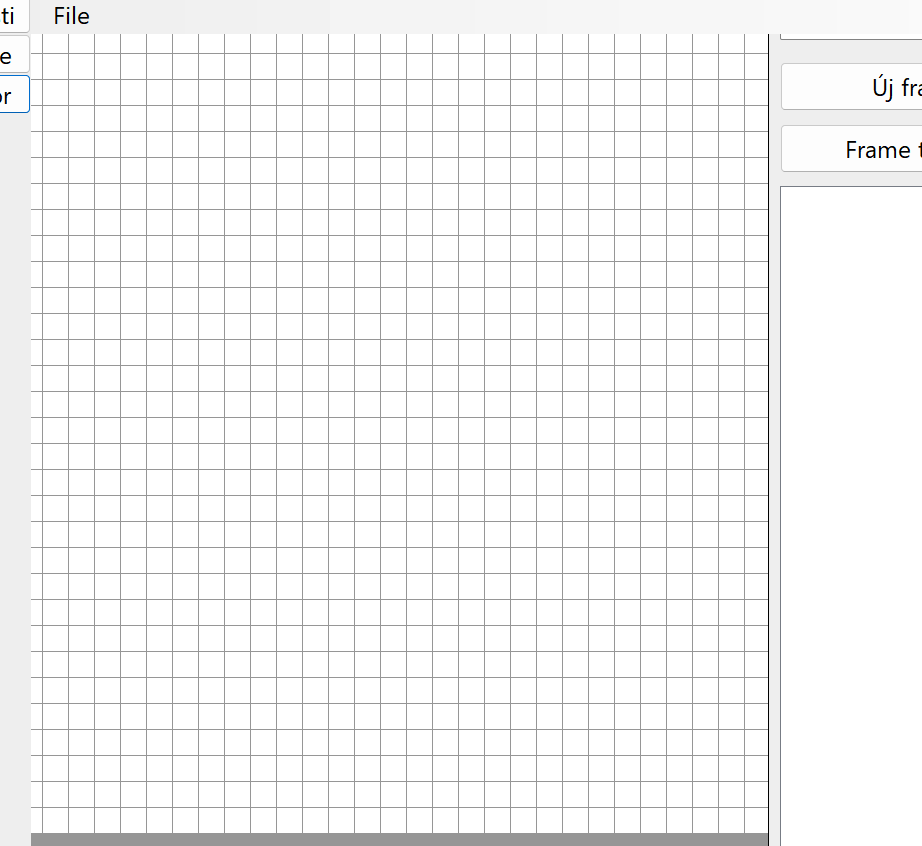
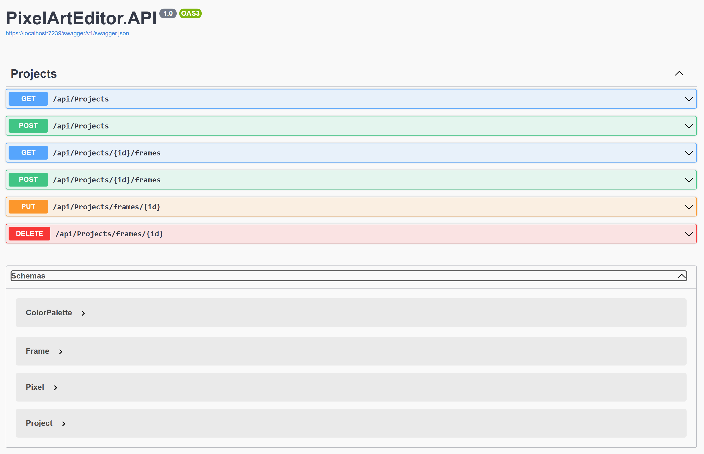

# Pixel Art Editor Dokumentáció
Név: Németh István Ákos
Neptun: I0FL42

## Projekt rövid leírása:
Ez egy Pixel Art Editor alkalmazás akart lenni, ami animált pixel art gifek készítésére való. A felhasználó tud új projekteket létrehozni, frame-eket szerkeszteni, előnézetet megtekinteni és statisztikákat generálni az egyes projekteken belüli színhasználatról. Az alkalmazás Windows Forms felülettel rendelkezik, és Azure SQL adatbázist használ az adatok tárolására. Előre tudtam, hogy kevés lesz erre 1,5 óra, és meg akartam csinálni a scriptek pár részét előre, de sajnos nagyon nem volt időm, ezért nem teljesen funkcionális az alkalmazás, de természetesen lefordul és amire a pontok járnak az működik. A többit talán majd máskor:)

## Adatbázis (7p)

- 3x1p: Az alkalmazás 4 táblát használ:
 - Projects: Projektek alapadatai (név, méret, létrehozás dátuma)
 - Frames: Animációs frame-ek tárolása
 - Pixels: A frame-ek pixeleinek pozíciói és színei
 - ColorPalettes: Elérhető színek tárolása
- 1p: Az adatbázis az alábbi constraint-eket tartalmazza:
 - ColorHex formátum check (#RRGGBB formátumú színkódok)
 - CanvasWidth és CanvasHeight pozitív érték check (1-64 között)
- 2p: Az adatbázis Azure SQL szerveren fut
- 1p: Az adatbázis struktúra a pixel art szerkesztéshez szükséges alapvető elemeket tartalmazza, előre feltöltött alap színpalettával

Részösszeg: 7p

## Windows Forms (17p)

### UserControl-ok használata (6p)

- PixelEditorControl: A fő szerkesztő felület DataGridView alapú pixel rajzolással
- PreviewControl: Animáció előnézet lejátszása Timer segítségével
- StatsControl: Statisztikák és diagram megjelenítése

### Kilépés megerősítése (2p)

- Az alkalmazásból való kilépés előtt megerősítő kérdés jelenik meg

### DataGridView használata (2p)

- A pixel szerkesztő egy testreszabott DataGridView-t használ
- A cellák négyzet alakúak és színezhetők

### Excel export (7p)

- Az alkalmazás képes Excel fájlba exportálni a statisztikákat
- Színhasználati statisztikák és projekt adatok exportálása
- A színek előnézete az Excel cellákban is megjelenik

Részösszeg: 17p

## Egyéb, extra (7p)

### Scaffold-DbContext használata (2p)
- Az adatbázismodellek automatikusan generálva lettek

### Színhasználati diagram (5p)
- Oszlopdiagram mutatja a különböző színek használati gyakoriságát

Részösszeg: 7p

## API Végpontok (21p)

### GET /api/projects (3p)
- Összes projekt lekérdezése
- A válasz tartalmazza a projektek összes adatát és a hozzájuk tartozó frame-eket

### GET /api/projects/{id}/frames (2p)
- Egy projekt frame-jeinek lekérdezése
- A válasz tartalmazza a frame-ek részletes adatait és a pixeleket

### POST /api/projects (5p)
- Új projekt létrehozása
- Validálja a kötelező mezőket és a méret korlátokat

### POST /api/frames (5p)
- Új frame hozzáadása egy projekthez
- Automatikusan beállítja a következő frame számot

### PUT /api/frames/{id} (3p)
- Frame módosítása
- A frame delay és egyéb tulajdonságok frissítése

### DELETE /api/frames/{id} (3p)
- Frame törlése a hozzá tartozó pixelekkel együtt
- Referenciális integritás kezelése

Részösszeg: 21p

## Összesen: 52 pont
